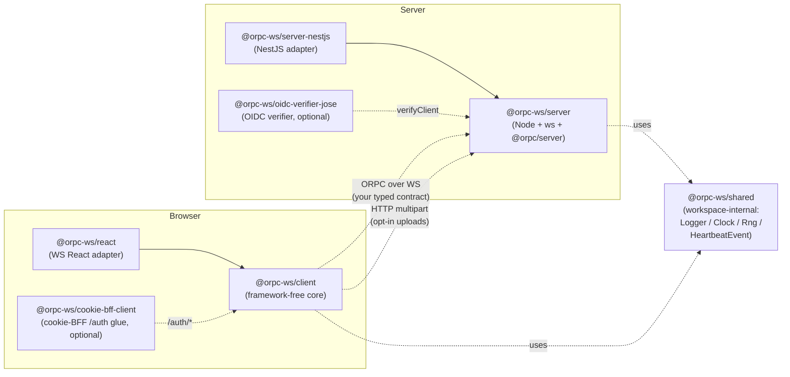

# `@orpc-ws/*`

The typed ORPC client/server for an app that talks to its backend over
a long-lived WebSocket. Reconnect, heartbeat, sleep detection, auth
refresh, single-session-per-user, opt-in HTTP uploads, and opt-in
server→client RPC (the server calls procedures the client hosts, over the
same socket) — all extracted from one production app into reusable packages,
with ~340 unit tests across the published packages and a real-Keycloak
Playwright e2e on every push.

An optional server-side JWT verifier (`@orpc-ws/oidc-verifier-jose`) covers
the backend-token / native path — the client sends a Bearer access token over
the WS handshake and the server verifies it against any OIDC-compliant IdP
(Keycloak, Auth0, Okta, Cognito, Google).

## Architecture



The contract is your TypeScript ORPC contract — neither core knows its
shape. Both parameterize on `<TContract>` and pass it through end-to-end.

## Packages

### Transport (required)

| Package | One-liner | Framework deps |
|---|---|---|
| [`@orpc-ws/client`](./packages/orpc-ws-client) | Browser core. Connect, reconnect, heartbeat, sleep detection, typed RPC. | none |
| [`@orpc-ws/react`](./packages/orpc-ws-react) | The sole React adapter — WS-transport bindings (depends only on `@orpc-ws/client`). Hooks: `useConnectionState`, `useWsSubscription`, `OrpcWsProvider`, `useOrpcWs`; plus `<OrpcWs>`, a construct-and-own provider that also hosts a React-aware server→client `clientRouter`. | `react` peer |
| [`@orpc-ws/server`](./packages/orpc-ws-server) | Server core. Vanilla Node + `ws` + `@orpc/server`. Attach to `http.Server`. | none |
| [`@orpc-ws/server-nestjs`](./packages/orpc-ws-server-nestjs) | NestJS adapter. `OrpcWsModule.forRootAsync({...})`, `OrpcWsService` injectable. | `@nestjs/common`, `@nestjs/core` peer |
| [`@orpc-ws/shared`](./packages/orpc-ws-shared) | Shared seam types (Logger / Clock / Rng / heartbeat wire shape). Published — it's a runtime dependency of the cores. | none |

### Auth (optional)

| Package | One-liner | Runtime |
|---|---|---|
| [`@orpc-ws/oidc-verifier-jose`](./packages/oidc-verifier-jose) | Server JWT verifier for the backend-token / native path. Discovery-driven JWKS, configurable `boundClaim` (`azp`/`aud`/`false`). | Node, depends on `jose` |
| [`@orpc-ws/cookie-bff`](./packages/orpc-ws-cookie-bff) | Framework-free cookie-BFF server core — server holds tokens, browser holds only an opaque httpOnly `sid`. Session store, PKCE exchange + refresh, `/auth/*` handlers, the cookie WS verifier. | Node |
| [`@orpc-ws/cookie-bff-nestjs`](./packages/orpc-ws-cookie-bff-nestjs) | NestJS adapter for the cookie-BFF core. `CookieBffModule.forRoot/forRootAsync` wires the WS transport + `/auth/*` controller. | `@nestjs/*` peers |
| [`@orpc-ws/cookie-bff-client`](./packages/orpc-ws-cookie-bff-client) | Browser glue for the cookie-BFF `/auth/*` client protocol (CSRF-aware `me()` / `mutate()` / `loginUrl()` / `logout()`). | browser, zero deps |

## Quickstart

```ts
import { createOrpcWsClient } from "@orpc-ws/client";
import type { AppContract } from "@your-monorepo/contract";

// Supply your own TokenProvider — e.g. a backend-token / native path where
// the server mints a short-lived access token the client pulls and refreshes.
// (For cookie-BFF or authless, omit `tokenProvider` entirely.)
export const wsClient = createOrpcWsClient<AppContract>({
  url: import.meta.env.VITE_WS_URL,
  tokenProvider: {
    getToken: () => sessionStorage.getItem("accessToken"),
    refresh: async () => {
      const r = await fetch("/auth/token", { method: "POST" });
      return r.ok ? (await r.json()).accessToken : null;
    },
  },
  onTerminalAuthFailure: () => { location.href = "/login"; },
});

wsClient.connect();
const { pong } = await wsClient.rpc.ping(); // fully typed
```

## Demo

Three runnable demos cover three auth models (two authenticated + one
authless), each a React SPA paired with a single-mode NestJS server. SPA and
server are always **two separate processes** (mirrors a real deploy — SPA on a
CDN / static host, API on its own process), but each demo now starts **both**
with one command: a single `pnpm dev:<mode>` launches that app's server and
client together (turbo runs the two processes in parallel).

| Demo | Auth model | Library packages imported | Run (server + SPA) | Ports (server / dev / preview) |
|---|---|---|---|---|
| [`apps/demo-backend-token`](./apps/demo-backend-token) | Custom `TokenProvider` — server mints a short-lived access token the browser pulls and passes via WS `?token=` | `@orpc-ws/client` + `@orpc-ws/react` (no OIDC packages — the WS-only consumer path) | `pnpm dev:backend-token` | 18082 / 5174 / 4174 |
| [`apps/demo-cookie-bff`](./apps/demo-cookie-bff) | httpOnly `sid` session cookie — authenticates the WS handshake automatically, no `?token=` | `@orpc-ws/client` + `@orpc-ws/react` (no OIDC packages, no `tokenProvider`) | `pnpm dev:cookie-bff` | 18083 / 5175 / 4175 |
| [`apps/demo-authless`](./apps/demo-authless) | **None** — library `mode: "authless"`, every WS upgrade accepted; no IdP, no secrets, no `.env` beyond an optional `VITE_WS_URL` (the simplest demo to run) | `@orpc-ws/client` + `@orpc-ws/react` (no OIDC packages, no `tokenProvider`) | `pnpm dev:authless` | 18084 / 5176 / 4176 |

Build all demo apps with `pnpm build:demo`; preview a built SPA via its own
package, e.g. `pnpm --filter @demo/cookie-bff-client preview`.

The two **backend** modes run the OIDC Authorization-Code flow server-side as
a **public PKCE client** (no client secret — the code exchange sends a PKCE
`code_verifier`). They need their callback redirect URIs registered on the
`orpc-ws-demo` Keycloak realm's client:
`http://localhost:18082/auth/callback` (backend-token) and
`http://localhost:18083/auth/callback` (cookie-bff).

## Status

**v0.x — not yet stable.** Public surface is locked at the design level;
the source-app migration is the gap-finding pass before 1.0, so expect
minor API tweaks. Behavior is well-tested — ~340 unit tests across the
published packages, real-Keycloak Playwright e2e against a Testcontainer on
every push.

## Repo layout

```
packages/         # 9 packages (transport cores + React adapter + JWT verifier + cookie-BFF trio)
apps/             # demo-{backend-token,cookie-bff,authless}/ — each self-contained {contract,server,client}
tests-e2e/        # Playwright + Testcontainers Keycloak
docs/             # implementation-plan, migration guide, mermaid diagrams
```

`corepack enable` then `pnpm install` from the root (pnpm version is pinned
in the root `package.json` `packageManager` field). `pnpm exec turbo run test`
for the unit suite.

For any demo, copy **both** env templates — the SPA's and the server's. Each
SPA reads its `VITE_*` vars at build time and fails loudly if they're missing:
the two backend SPAs need `VITE_WS_URL` + `VITE_SERVER_ORIGIN` (the authless
SPA needs only an optional `VITE_WS_URL`). Each demo's server loads its own
`apps/demo-<mode>/server/.env` (e.g., `apps/demo-backend-token/server/.env`),
which carries `OIDC_ISSUER_URL` / `OIDC_CLIENT_ID`, the server port, and
any auth-specific vars like SPA-origin or session-cookie settings (see its
`.env.example`). A local
Keycloak (or any OIDC IdP) must be running separately; the e2e suite spins
one up in a Testcontainer.

## See also

- [Migration guide](./docs/migration-anki-mcp-saas.md) — from a hand-rolled NestJS gateway
- [Sequence diagrams](./docs/diagrams/) — `connect`, `reconnect on auth failure`, `heartbeat tick`, `kicked`, `upload`
- [Implementation plan](./docs/implementation-plan.md)
- [CLAUDE.md](./CLAUDE.md) — binding non-negotiables and resolved decisions

## Module formats

Every published package except `@orpc-ws/react` ships **dual
ESM + CommonJS** (built with [tshy](https://github.com/isaacs/tshy)) —
`import` resolves to ESM, `require` to CommonJS, each with its own types.
`@orpc-ws/react` is **ESM-only** (a module-level React `createContext`
makes a dual build a dual-package-identity hazard).

**CommonJS consumers need Node ≥ 20.19 or ≥ 22.22.** The CJS builds keep
their dependencies external, and `@orpc/*` / `jose` are ESM-only; loading
them via `require()` of an ESM module is only supported on those Node
versions. ESM consumers have no such floor.

## License

MIT — see [LICENSE](./LICENSE).
