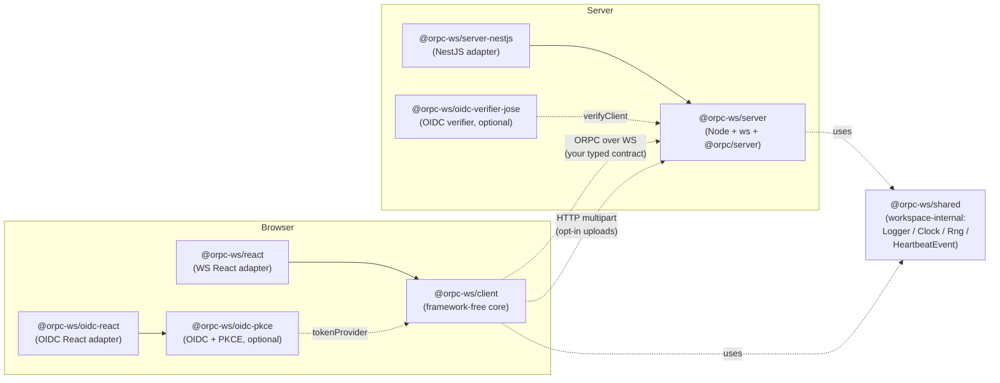

# `@orpc-ws/*`

The typed ORPC client/server for an app that talks to its backend over
a long-lived WebSocket. Reconnect, heartbeat, sleep detection, auth
refresh, single-session-per-user, opt-in HTTP uploads — all extracted
from one production app into reusable packages, with ~340 unit tests
across 6 packages and a real-Keycloak Playwright e2e on every push.

Optional OIDC / PKCE auth helpers (`@orpc-ws/oidc-pkce` for the browser,
`@orpc-ws/oidc-verifier-jose` for the server) cover any OIDC-compliant IdP
— Keycloak, Auth0, Okta, Cognito, Google.

## Architecture



The contract is your TypeScript ORPC contract — neither core knows its
shape. Both parameterize on `<TContract>` and pass it through end-to-end.

## Packages

### Transport (required)

| Package | One-liner | Framework deps |
|---|---|---|
| [`@orpc-ws/client`](./packages/orpc-ws-client) | Browser core. Connect, reconnect, heartbeat, sleep detection, typed RPC. | none |
| [`@orpc-ws/react`](./packages/orpc-ws-react) | WS-transport React adapter (depends only on `@orpc-ws/client`). Hooks: `useConnectionState`, `useWsSubscription`, `OrpcWsProvider`, `useOrpcWs`. | `react` peer |
| [`@orpc-ws/oidc-react`](./packages/orpc-ws-oidc-react) | OIDC-auth React adapter (depends only on `@orpc-ws/oidc-pkce`). Hooks: `useAuthState`, `useUser`, `useOidcCallback`, `RequireAuth`. Optional `./react-router` sub-path adds the `OidcCallback` `<Route>`. | `react` peer (+ optional `react-router-dom`) |
| [`@orpc-ws/server`](./packages/orpc-ws-server) | Server core. Vanilla Node + `ws` + `@orpc/server`. Attach to `http.Server`. | none |
| [`@orpc-ws/server-nestjs`](./packages/orpc-ws-server-nestjs) | NestJS adapter. `OrpcWsModule.forRootAsync({...})`, `OrpcWsService` injectable. | `@nestjs/common`, `@nestjs/core` peer |
| [`@orpc-ws/shared`](./packages/orpc-ws-shared) | Shared seam types (Logger / Clock / Rng / heartbeat wire shape). Published — it's a runtime dependency of the cores. | none |

### Auth (optional, OIDC-generic)

| Package | One-liner | Runtime |
|---|---|---|
| [`@orpc-ws/oidc-pkce`](./packages/oidc-pkce) | Browser OIDC + PKCE flow. Discovery, PKCE crypto, token storage, refresh purity, callback handling. | browser, zero deps |
| [`@orpc-ws/oidc-verifier-jose`](./packages/oidc-verifier-jose) | Server JWT verifier. Discovery-driven JWKS, configurable `boundClaim` (`azp`/`aud`/`false`). | Node, depends on `jose` |

## Quickstart

```ts
import { createOrpcWsClient } from "@orpc-ws/client";
import { createOidcAuth } from "@orpc-ws/oidc-pkce";
import type { AppContract } from "@your-monorepo/contract";

const auth = createOidcAuth({
  issuerUrl: import.meta.env.VITE_OIDC_ISSUER_URL,
  clientId: import.meta.env.VITE_OIDC_CLIENT_ID,
  redirectUri: `${window.location.origin}/auth/callback`,
});

export const wsClient = createOrpcWsClient<AppContract>({
  url: import.meta.env.VITE_WS_URL,
  tokenProvider: auth.tokenProvider,
  onTerminalAuthFailure: () => auth.clearTokens(),
});

wsClient.connect();
const { pong } = await wsClient.rpc.ping(); // fully typed
```

## Demo

Three runnable demos cover three auth models, each a React SPA paired with
the multi-mode NestJS [`apps/demo-server`](./apps/demo-server) run in the
matching mode. SPA and server are always **two separate processes** (mirrors
a real deploy — SPA on a CDN / static host, API on its own process), so each
demo is "server script + SPA script". The single demo-server has three
bootstraps because the library's `OrpcWsModule` is single-instance per Nest
app, so one auth mode = one app = one process on its own port.

| Demo | Auth model | Library packages imported | Run (server + SPA) | Ports (server / dev / preview) |
|---|---|---|---|---|
| [`apps/demo-pkce`](./apps/demo-pkce) | Browser OIDC + PKCE | `@orpc-ws/oidc-pkce` + `@orpc-ws/oidc-react` + `@orpc-ws/react` | `pnpm dev:server:pkce` + `pnpm dev:pkce` (or `pnpm dev:demo`) | 18081 / 5173 / 4173 |
| [`apps/demo-backend-token`](./apps/demo-backend-token) | Custom `TokenProvider` — server mints a short-lived access token the browser pulls and passes via WS `?token=` | `@orpc-ws/client` + `@orpc-ws/react` (no OIDC packages — the WS-only consumer path) | `pnpm dev:server:backend-token` + `pnpm dev:backend-token` | 18082 / 5174 / 4174 |
| [`apps/demo-cookie-bff`](./apps/demo-cookie-bff) | httpOnly `sid` session cookie — authenticates the WS handshake automatically, no `?token=` | `@orpc-ws/client` + `@orpc-ws/react` (no OIDC packages, no `tokenProvider`) | `pnpm dev:server:cookie-bff` + `pnpm dev:cookie-bff` | 18083 / 5175 / 4175 |

Build all demo apps with `pnpm build:demo`; preview a built SPA with
`pnpm preview:demo:pkce` / `:backend-token` / `:cookie-bff`.

The two **backend** modes run the OIDC Authorization-Code flow server-side as
a **public PKCE client** (no client secret — the code exchange sends a PKCE
`code_verifier`). They need their callback redirect URIs registered on the
`orpc-ws-demo` Keycloak realm's client:
`http://localhost:18082/auth/callback` (backend-token) and
`http://localhost:18083/auth/callback` (cookie-bff).

## Status

**v0.x — not yet stable.** Public surface is locked at the design level;
the source-app migration is the gap-finding pass before 1.0, so expect
minor API tweaks. Behavior is well-tested — ~340 unit tests across 6
packages, real-Keycloak Playwright e2e against a Testcontainer on every
push.

## Repo layout

```
packages/         # 8 packages (6 transport + 2 OIDC helpers)
apps/             # demo-contract, demo-{pkce,backend-token,cookie-bff}, demo-server (multi-mode)
tests-e2e/        # Playwright + Testcontainers Keycloak
docs/             # implementation-plan, migration guide, mermaid diagrams
```

`corepack enable` then `pnpm install` from the root (pnpm version is pinned
in the root `package.json` `packageManager` field). `pnpm exec turbo run test`
for the unit suite.

For any demo, copy **both** env templates — the SPA's and the server's. Each
SPA reads its `VITE_*` vars at build time and fails loudly if they're missing:
`apps/demo-pkce/.env` needs `VITE_OIDC_ISSUER_URL`, `VITE_OIDC_CLIENT_ID`,
`VITE_WS_URL`, `VITE_UPLOAD_URL`; the two backend SPAs need `VITE_WS_URL` +
`VITE_SERVER_ORIGIN`. `apps/demo-server/.env` carries the shared
`OIDC_ISSUER_URL` / `OIDC_CLIENT_ID`, the per-mode ports
(`PORT_PKCE` / `PORT_BACKEND_TOKEN` / `PORT_COOKIE_BFF`), and the backend
modes' SPA-origin + session-cookie vars (see its `.env.example`). A local
Keycloak (or any OIDC IdP) must be running separately; the e2e suite spins
one up in a Testcontainer.

## See also

- [Migration guide](./docs/migration-anki-mcp-saas.md) — from a hand-rolled NestJS gateway
- [Sequence diagrams](./docs/diagrams/) — `connect`, `reconnect on auth failure`, `heartbeat tick`, `kicked`, `upload`
- [Implementation plan](./docs/implementation-plan.md)
- [CLAUDE.md](./CLAUDE.md) — binding non-negotiables and resolved decisions

## Module formats

Every published package except the two React adapters ships **dual
ESM + CommonJS** (built with [tshy](https://github.com/isaacs/tshy)) —
`import` resolves to ESM, `require` to CommonJS, each with its own types.
`@orpc-ws/react` and `@orpc-ws/oidc-react` are **ESM-only** (a
module-level React `createContext` makes a dual build a
dual-package-identity hazard).

**CommonJS consumers need Node ≥ 20.19 or ≥ 22.12.** The CJS builds keep
their dependencies external, and `@orpc/*` / `jose` are ESM-only; loading
them via `require()` of an ESM module is only supported on those Node
versions. ESM consumers have no such floor.

## License

MIT — see [LICENSE](./LICENSE).
