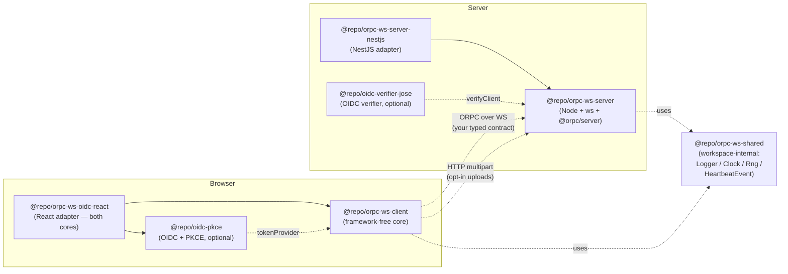

# `@repo/orpc-ws-*`

The typed ORPC client/server for an app that talks to its backend over
a long-lived WebSocket. Reconnect, heartbeat, sleep detection, auth
refresh, single-session-per-user, opt-in HTTP uploads — all extracted
from one production app into reusable packages, with ~340 unit tests
across 6 packages and a real-Keycloak Playwright e2e on every push.

Optional OIDC / PKCE auth helpers (`@repo/oidc-pkce` for the browser,
`@repo/oidc-verifier-jose` for the server) cover any OIDC-compliant IdP
— Keycloak, Auth0, Okta, Cognito, Google.

## Architecture



The contract is your TypeScript ORPC contract — neither core knows its
shape. Both parameterize on `<TContract>` and pass it through end-to-end.

## Packages

### Transport (required)

| Package | One-liner | Framework deps |
|---|---|---|
| [`@repo/orpc-ws-client`](./packages/orpc-ws-client) | Browser core. Connect, reconnect, heartbeat, sleep detection, typed RPC. | none |
| [`@repo/orpc-ws-oidc-react`](./packages/orpc-ws-oidc-react) | React adapter (separate sibling, depends on both cores). WS hooks (`useConnectionState`, `useWsSubscription`, `OrpcWsProvider`, `useOrpcWs`) + OIDC hooks (`useAuthState`, `useUser`, `useOidcCallback`, `RequireAuth`). Optional `./react-router` sub-path adds the `OidcCallback` `<Route>`. | `react` peer (+ optional `react-router-dom`) |
| [`@repo/orpc-ws-server`](./packages/orpc-ws-server) | Server core. Vanilla Node + `ws` + `@orpc/server`. Attach to `http.Server`. | none |
| [`@repo/orpc-ws-server-nestjs`](./packages/orpc-ws-server-nestjs) | NestJS adapter. `OrpcWsModule.forRootAsync({...})`, `OrpcWsService` injectable. | `@nestjs/common`, `@nestjs/core` peer |
| [`@repo/orpc-ws-shared`](./packages/orpc-ws-shared) | Internal: shared seam types. **Not published.** | none |

### Auth (optional, OIDC-generic)

| Package | One-liner | Runtime |
|---|---|---|
| [`@repo/oidc-pkce`](./packages/oidc-pkce) | Browser OIDC + PKCE flow. Discovery, PKCE crypto, token storage, refresh purity, callback handling. | browser, zero deps |
| [`@repo/oidc-verifier-jose`](./packages/oidc-verifier-jose) | Server JWT verifier. Discovery-driven JWKS, configurable `boundClaim` (`azp`/`aud`/`false`). | Node, depends on `jose` |

## Quickstart

```ts
import { createOrpcWsClient } from "@repo/orpc-ws-client";
import { createOidcAuth } from "@repo/oidc-pkce";
import type { AppContract } from "@your-monorepo/contract";

const auth = createOidcAuth({
  issuerUrl: import.meta.env.VITE_OIDC_ISSUER_URL,
  clientId: import.meta.env.VITE_OIDC_CLIENT_ID,
  redirectUri: `${window.location.origin}/auth/callback`,
});

export const wsClient = createOrpcWsClient<AppContract>({
  url: import.meta.env.VITE_WS_URL,
  tokenProvider: auth.tokenProvider,
  onTerminalAuthFailure: () => auth.clearTokens(),
});

wsClient.connect();
const { pong } = await wsClient.rpc.ping(); // fully typed
```

Full demo (React SPA + NestJS server against a real Keycloak):
[`apps/demo-spa`](./apps/demo-spa) + [`apps/demo-server`](./apps/demo-server).
The SPA and server are **two separate processes** (Vite on `:5173`, Nest
on `:18081`). Mirrors how a real deploy ships — SPA on a CDN / static
host, API on its own process.

## Status

**v0.x — not yet stable.** Public surface is locked at the design level;
the source-app migration is the gap-finding pass before 1.0, so expect
minor API tweaks. Behavior is well-tested — ~340 unit tests across 6
packages, real-Keycloak Playwright e2e against a Testcontainer on every
push.

## Repo layout

```
packages/         # 7 packages (5 transport + 2 OIDC helpers)
apps/             # demo-contract, demo-spa, demo-server
tests-e2e/        # Playwright + Testcontainers Keycloak
docs/             # implementation-plan, migration guide, mermaid diagrams
```

`npm install` from the root. `npx turbo run test` for the unit suite.

For `npm run dev:demo`: first copy `apps/demo-spa/.env.example` →
`apps/demo-spa/.env` (the SPA reads `VITE_OIDC_ISSUER_URL`,
`VITE_OIDC_CLIENT_ID`, `VITE_WS_URL` at build time and fails loudly if
they're missing). A local Keycloak (or any OIDC IdP) must be running
separately; the e2e suite spins one up in a Testcontainer.

## See also

- [Migration guide](./docs/migration-anki-mcp-saas.md) — from a hand-rolled NestJS gateway
- [Sequence diagrams](./docs/diagrams/) — `connect`, `reconnect on auth failure`, `heartbeat tick`, `kicked`, `upload`
- [Implementation plan](./docs/implementation-plan.md)
- [CLAUDE.md](./CLAUDE.md) — binding non-negotiables and resolved decisions

## License

TBD — pre-1.0; license decision before first publish.
