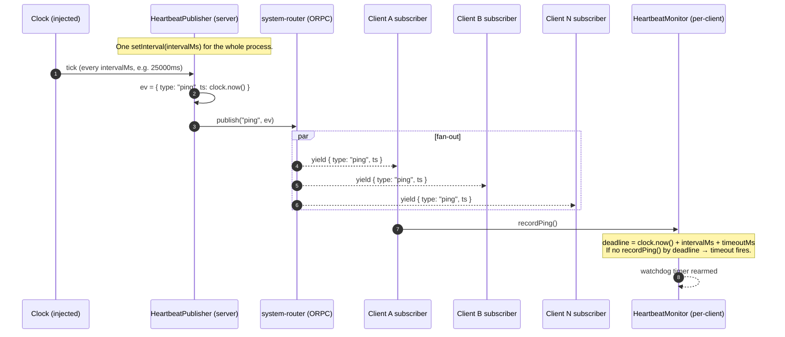

# Sequence — heartbeat tick (single timer, N subscribers)

The library's heartbeat is published as an ORPC AsyncIterable
subscription at the reserved namespace `__orpc_ws_lib__.heartbeat`.
**One** server-side timer fans out to **N** client subscribers via the
`MemoryPublisher` — not N timers.

Why this matters:

- **One timer for N clients** is the load-bearing scalability claim
  for the heartbeat path. The source app's earlier approach of one
  timer per connection was the reason its gateway had a `Map<WebSocket,
  NodeJS.Timeout>` cleanup foot-gun. (Bug 8 documented the related
  framing issue: heartbeat went over raw `ws.send()` instead of ORPC,
  bypassing the typed channel.)
- **Per-client monitor.** Each subscribed client has its own
  `HeartbeatMonitor` with an injected `Clock`. Deadline arithmetic uses
  the client's clock, not the wire-carried `ts` — clock skew between
  server and client can't artificially trip the watchdog.
- **AsyncIterable through ORPC, not raw WS.** The library calls
  `link.call(["__orpc_ws_lib__","heartbeat"], undefined, { signal })`
  on the same `RPCLink` instance the consumer's typed proxy uses.
  Framing is identical to every other RPC; nothing special on the wire.
- **`config` event is sent once at subscribe**, before the first `ping`.
  It carries `intervalMs` + `timeoutMs` so the client's watchdog gets
  the deadline from the server, not from a hardcoded constant.

## Belt-and-braces: WS-protocol ping/pong

Independent of the application-layer heartbeat, the server also runs
the WS-protocol ping/pong watchdog (`ws.ping()` → browser auto-pong).
Missing two consecutive pongs → connection is a zombie → terminate.
That path is not in this diagram — see
[`packages/orpc-ws-server/src/heartbeat/ws-ping-pong.ts`](../../packages/orpc-ws-server/src/heartbeat/ws-ping-pong.ts).
Two independent paths because they catch different failure modes:
ORPC stalls (server can't produce events) vs kernel-level dead sockets.
