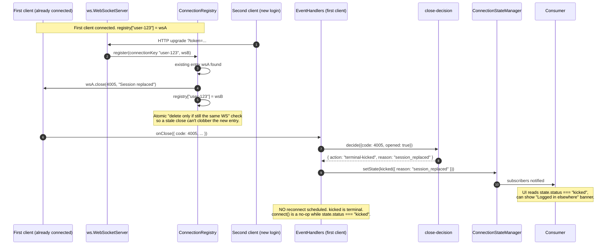

# Sequence — single session per user (close 4005, terminal "kicked")

User logs in from a second tab / device. The server's
`ConnectionRegistry` sees an existing entry for that user, replaces
it, and closes the older socket with `4005`. The first client moves to
the terminal `kicked` state — no reconnect attempted.

Key invariants:

- **`4005` is library-reserved** for "session replaced." The close
  code is the wire signal; the client's `close-decision` tree
  recognizes it and short-circuits to terminal.
- **`kicked` is terminal.** `connect()` no-ops, the reconnect manager
  refuses to schedule. The only way out is to create a new
  `OrpcWsClient` — which is what the consumer does after the user
  re-auths in a tab that still has session.
- **Registry uses atomic delete-if-same** to avoid the close-clobbering
  race: a stale close from the old WS arriving after the new WS is
  registered would otherwise erase the new entry. (Bug 9 server-side.)
- **`onKicked` hook fires on the server** as part of the registry
  replace, so consumers can audit the kick (`onKicked(user,
  replacedBy)`).
